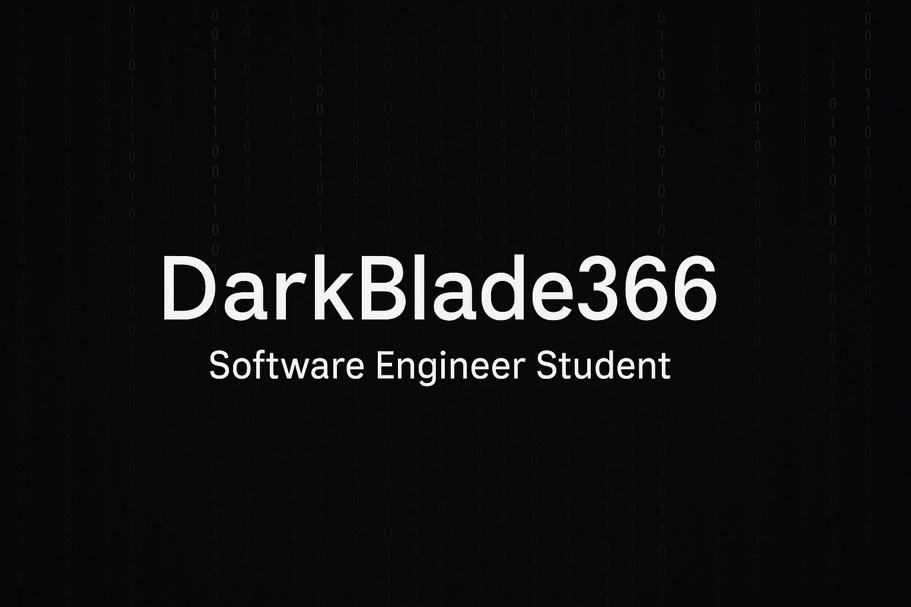

<h2 align="center">¡Hola! 👋 Soy Xavier Ramirez Fernandez</h2>
<h4 align="center">Estudiante de Ingeniería Informática en CUJAE | Futuro Ingeniero</h4>

---

### 🚀 Sobre mí

Apasionado por la tecnología y el desarrollo de software. Me encanta aprender y dedicar tiempo a proyectos que considero interesantes y valiosos. Actualmente enfocado en **Laravel** y explorando nuevas tecnologías.

---

### 🛠️ Tecnologías y Herramientas

  
  
  
  
  
  

---

### 🌱 Aprendiendo actualmente

- Laravel (Framework PHP)
- JavaScript
- Desarrollo web moderno
- Buenas prácticas en programación

---
### 📫 Contacto

- **WhatsApp:** +53 52662487
- **Correo:** xavierramirezf@gmail.com

---

  IN PROGRESS

